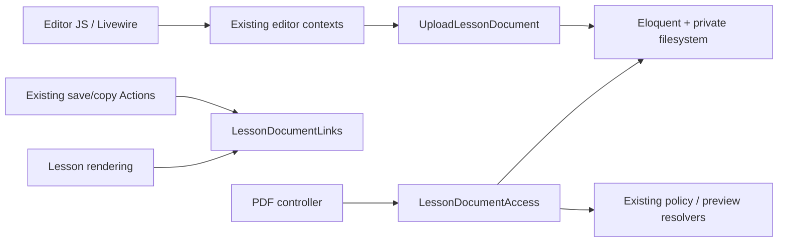

# Architecture: private PDF links in lesson content

## 1. Context, references and decision scope

Run `pdf-editor-20260914`; scope `pdf-links-v1`. Inputs: [request.md](request.md), [plan.md](plan.md), [design.md](design.md), and `.toscanini/runtime/runs/pdf-editor-20260914/execution-contract.json`. AC-01–AC-06 and INV-01–INV-04 are authoritative. QA-01–QA-09 are the complete proposed validation scope; there are no separate FR/SC identifiers. Only `oceanix-api` is affected. No external reference project was supplied. Existing preview access remains valid authority, including its existing expiring token mechanism; a PDF identifier alone never grants access.

| Convention / decision | Evidence | Classification | Why needed |
| --- | --- | --- | --- |
| Thin Livewire coordinator, context adapters, `handle` Actions | `AGENTS.md`, `app/Livewire/CourseEditor/EditorCoordinator.php`, `Contexts/*`, `app/Actions/Courses/SaveCompanyCourseEditorDraft.php` | Existing | Preserve editor authorization and staged saves |
| Private storage and immutable document metadata | `app/Actions/Videos/UploadEditorContentImage.php`, `app/Models/ContentImage.php`, `config/filesystems.php` | New feature-local | Image upload UX is reusable evidence; its public delivery is unsuitable for AC-03 |
| Stable reference plus lesson attachment association | `app/Models/ModuleVersion.php`, `app/Actions/Courses/CreateDraftFromVersion.php`, `app/Actions/Modules/CreateModuleDraft.php` | New feature-local | Module versions are lesson-table records; copies must retain document provenance |
| Context-specific read authorization | `UserTrainingAssignmentPolicy`, `PublicPreviewResolver`, `PlatformCoursePreview`, company lesson-preview component | Existing boundary, new PDF adapters | Recheck the containing lesson/version on every request |
| One PDF modal and toolbar control | `docs/control-center-design-system.md`, `course-editor/root.blade.php`, `resources/js/content-editor.js` | New feature-local using existing UI | AC-01, AC-04, AC-06 |

### Framework suitability and reference assessment

| Target / installed version | Guidance actually consulted | Reference assessment | Native choice and tradeoffs | Alignment |
| --- | --- | --- | --- | --- |
| Oceanix: Laravel 13.26.1, Livewire 4.4.1, confirmed using Composer InstalledVersions | `AGENTS.md`; installed Toscanini `templates/adapters/laravel.json`; `.agents/skills/toscanini-workflow/references/installation.md`; official documentation linked below | Internal image upload supplies UI/action conventions only; public image URLs rejected for PDFs. Existing preview classes supply compatibility contracts. No external reference architecture | Eloquent metadata and relationships, private filesystem, Livewire temporary upload, Actions and focused read service. Streaming through application costs application bandwidth but rechecks revocation; storage URLs would bypass this boundary | Aligned; no material framework conflict or deviation |

Consulted official sources: [Laravel 13 filesystems](https://laravel.com/framework/docs/13.x/filesystem), [Laravel 13 file validation](https://laravel.com/framework/docs/13.x/validation#validating-files), [Laravel 13 authorization](https://laravel.com/framework/docs/13.x/authorization), [Livewire 4 uploads](https://livewire.laravel.com/docs/4.x/uploads). These support native private disks, content-based file validation, Gates/Policies and temporary uploads. Action/service separation is the project's choice, not a Laravel mandate. Boost is optional here; `vendor/laravel/boost` is absent, Composer lock has no Boost package and tool discovery exposed no Boost documentation tool. Official versioned documentation was used; no Boost invocation is claimed.

Testing strategy is separate: follow the project's Pest conventions and demonstrate intended failing tests before implementation where feasible; otherwise record defect-sensitive evidence. No new testing-strategy decision is needed.

## 2. Architectural style

Framework-native Laravel application with thin Livewire presentation, existing editor contexts, one upload Action, focused document authorization/delivery and HTML reference services, and Eloquent persistence. No repository abstraction, new domain layer or global editor refactor is justified. Reuse existing auth and preview boundaries. PDF upload is a subordinate existing course/module editing operation, not a separately grantable document-management feature.

## 3. Directory and module structure

All additions are feature-local; existing files are extended only at PDF integration seams.

```text
app/Actions/Documents/UploadLessonDocument.php                 new
app/Models/LessonDocument.php                                 new
app/Services/Documents/LessonDocumentAccess.php                new
app/Services/Documents/LessonDocumentLinks.php                 new
app/Http/Controllers/LessonDocumentController.php              new
app/Livewire/CourseEditor/EditorCoordinator.php                 extend
app/Livewire/CourseEditor/Contexts/{CompanyCourse,SharedCourse,SharedModule}EditorContext.php
app/Actions/Courses/SaveCompanyCourseEditorDraft.php            extend reference validation
app/Actions/{Courses,Modules}/...                              PDF-bearing save/copy seams only
app/Models/Lesson.php                                         documents relationship
resources/js/content-editor.js                               selection and insertion
resources/js/course-editor.js                                PDF operation guard if needed
resources/views/components/course-editor/root.blade.php        toolbar/modal
resources/views/flux/editor/pdf.blade.php                      toolbar primitive if needed
resources/views/components/lesson-content.blade.php            contextual link rendering
resources/views/components/training/⚡lesson.blade.php          split-content rendering seam
resources/views/{course-preview,platform}/...                  existing PDF-bearing preview seams
routes/web.php                                                guarded PDF read routes
config/filesystems.php                                       private lesson_documents disk
database/migrations/...create_lesson_documents_tables.php      additive
lang/pt_BR.json                                               English source translations
tests/Feature/Documents/...                                   focused persistence/access tests
tests/Feature/CourseEditor/...                                upload/staged-save coverage
tests/Browser/...                                             PDF editor/browser behavior
```

The Worker identifies all existing copy/save call sites carrying `content_markdown`; this inventory is an implementation task, not permission to change unrelated copying behavior.

## 4. Class responsibilities and non-use

| Type | Responsibility / principal class | Deliberate non-use |
| --- | --- | --- |
| Livewire | Coordinator owns modal, temporary upload, stable record identity and operation outcome; existing contexts resolve actor/root/record and call Action | No storage or document queries in component/view classes |
| Controller | `LessonDocumentController` has explicit `training`, `company`, `platformCourse`, `platformModule`, `preview` read methods; delegates authorization then returns stream | Not invokable: routes have distinct authority signatures; no generic client-selected auth-mode switch |
| Form Request | N/A: upload uses Livewire and Action validation; read route parameters use binding/format constraints | No unused HTTP upload endpoint |
| API Resource | N/A: internal upload result is explicit id/name/reference fields and PDF read returns bytes | No JSON resource abstraction |
| Action | `UploadLessonDocument::handle` validates, locks/rechecks editable target, stores unique private bytes, creates metadata and lesson association | No content save inside upload |
| Service / external client | `LessonDocumentAccess` resolves named access contexts, verifies association and saved HTML membership, then obtains private stream; `LessonDocumentLinks` parses/canonicalizes references, validates attachment membership and maps display URLs | No generic DocumentService; no new external client |
| Repository / Query Object | N/A; Actions/services use Eloquent directly | No wrappers around every query |
| DTO / Value Object | N/A; explicit method parameters, named context methods, and small documented result arrays suffice | No new hierarchy of authorization DTOs |
| Model | `LessonDocument` immutable metadata; `Lesson::documents()` retained many-to-many association | Never computes a public URL; no operational delete/update API |
| Policy / authorization service | Existing course/version policy, assignment execute policy, PlatformAccess and preview resolvers remain authoritative; `LessonDocumentAccess` composes these with PDF membership | No generic document permission that bypasses containing training |
| Job / command | N/A; bounded 10 MB upload synchronous | No cleanup job removing retained documents |
| Event / listener | N/A; this feature introduces no compliance evidence event | No PDF-read tracking |

## 5. Invocation, naming and query placement

Action entry is `handle`, matching repository convention. Persistence model `LessonDocument` maps to `lesson_documents`; no Record suffix. Access service exposes named methods per route context. Eloquent queries belong in the upload Action, access/reference services, existing save/copy Actions, relationships and existing authority resolvers. They are forbidden in JavaScript, Blade rendering, new coordinator methods and new controllers. Existing context adapters may call snapshot resolvers; do not add duplicated authorization queries there.

Store a canonical anchor `href="/lesson-documents/{uuid}"`, `target="_blank"`, `rel="noopener noreferrer"` in lesson HTML. This is a stable reference, not a byte endpoint; the uncontextualized route returns no file. Use strict anchored parsing of this exact application-relative form. Do not interpret arbitrary URLs, query strings or filenames as document identity. Existing sanitizer already preserves these attributes. `LessonDocumentLinks` maps only canonical PDF anchors to authorized context routes after sanitation; ordinary links remain unchanged. Preserve canonical HTML in the editor and database, never persist preview tokens or assignment-specific URLs. Apply mapping to both halves of content split around a video.

## 6. Dependency direction



Presentation calls application services; services never import Livewire components or manipulate browser state. The link mapper receives explicit context parameters or a server-supplied URL callback, never ambient unvalidated route guessing. Controllers never accept filesystem paths or raw disk names. Storage metadata remains server-side. No PDF subsystem calls video providers, assessment/progress projectors or compliance-event recording.

## 7. Cross-cutting ownership and system contracts

| Concern | Owner | Contract |
| --- | --- | --- |
| Validation | Upload Action; reference service called by existing save Actions | `required`, `file`, content-detected PDF MIME, maximum 10240 KB; client extension hints are UX only. Label is escaped text. Saved canonical IDs must have a retained association with the target lesson; forged/unattached IDs fail validation |
| Authorization | Access service and existing authorities | Fresh actor/activity and existing route permissions; upload resolves exact editable record. Training reads require explicit assignee identity, current `execute` authorization and `includesLesson`, so admin bypass cannot impersonate a learner. Recheck each byte request, including subsequent browser requests |
| Tenant/data ownership | Upload Action, access service | Metadata records company ID or shared ownership from server-resolved lesson only. No cross-company attachment. Shared module content may appear in an authorized company assignment; do not incorrectly require shared document company ID to equal learner company |
| Mapping | Link service + editor JS | Stable UUID reference in saved content, contextual URL only in rendered output. Capture selection before modal focus, restore against stable record key, insert one link, end link mark, restore focus; stale/cancelled completion inserts nothing |
| Transactions/concurrency | Upload and existing save/copy Actions | Follow existing root/version/lesson lock order and revision checks; reauthorize/recheck editable state inside metadata transaction after file transfer. Upload never overwrites staged HTML or changes published content. Save inserts link through existing explicit save transaction |
| Persistence | LessonDocument + relation | `lesson_documents`: id, unique UUID `public_id`, nullable company ID, is_shared, sanitized original name, disk, generated unique path, mime_type, size_bytes, timestamps. `lesson_document` association: lesson_id, lesson_document_id, unique pair; restrictive foreign keys. Metadata/path/bytes immutable after creation; associations retained when links removed |
| External calls/protocol | Laravel filesystem | Dedicated local private disk rooted under `storage/app/private/lesson-documents`, `serve=false`, no public URL/symlink, throwing write failures. No new credentials or remote API. Serve with `application/pdf`, safe inline filename, `Cache-Control: private, no-store`, `X-Content-Type-Options: nosniff`, `Referrer-Policy: no-referrer`; no redirect to object storage |
| Failure translation | Coordinator/controller | Validation errors remain associated with modal field; preserve text and selection. Stream acquisition failure returns ordinary unavailable/error response without exposing path; existing unauthorized/not-found/expired-preview status semantics retained. Never send success insertion event before committed metadata |
| Serialization | Context adapter/controller | Upload result contains UUID/name/canonical reference only. Never serialize disk/path/token into stored content; use framework disposition escaping for filename |
| Configuration | filesystems.php | New dedicated disk avoids public-image disk defaults; `.env` untouched. Runtime storage must persist across deployments; readiness checks verify writable disk and upload limits |
| Telemetry | Existing exception reporting | Report storage failure without raw document contents, sensitive tokens or filesystem paths in user messages; no compliance events or analytics |
| Retry | Coordinator/Action | Disable duplicate submission while busy; failure/cancelled operation does not insert. Manual retry allowed. Unique storage paths prevent overwrite; no background retry. Cleanup only uncommitted upload bytes if metadata transaction fails; retained operational files never removed |
| Migration/rollback | Additive migration | Add metadata and join tables; no rewrite of existing lessons. Copy associations transactionally when copying a lesson's HTML, including shared-module draft copies. Compositions reusing same lesson need no duplicate association. Deployment rollback retains tables/files once used; migration down only on empty/disposable feature data, otherwise fail with explicit retention reason |

Read eligibility requires BOTH retained association and canonical anchor in current saved HTML of the resolved lesson. Association alone cannot make removed/unpublished links reachable to learners. Newly uploaded but unsaved documents remain inaccessible through delivery routes until linked and saved. Authors can insert first and preview after saving; no extra unsaved-document preview is introduced. Successful upload followed by cancellation may leave retained private metadata/bytes but inserts no link (AC-04, AC-05).

## 8. Concrete execution flows

1. **Upload/insert:** PDF toolbar → selection snapshot + modal → Coordinator identifies stable record → appropriate Context → `UploadLessonDocument::handle` resolves current root/lesson using existing snapshot authority, validates upload, stores unique private bytes, rechecks locks/authorization and creates metadata/association → UUID result → insert canonical anchor into staged HTML only. Existing Save Action sanitizes and validates reference associations, then persists under revision guard. Failure leaves text unchanged.
2. **Learner read:** rendered saved lesson maps UUID to `my-training/{assignment}/lessons/{lesson}/documents/{uuid}` → existing authenticated/company middleware → controller → access service refreshes identity/assignment, explicit ownership + execute Gate + includesLesson → saved HTML membership and relation → private stream. Revoked access fails on the next request (AC-02, AC-03).
3. **Author/preview read:** add `/documents/{uuid}` under each corresponding existing guarded route family. Company author uses update-course permission, company ownership and version membership as company lesson preview does. Platform course uses `PlatformCoursePreview::lesson`; shared-module preview uses current active PlatformAccess, SharedModulesView, shared module/version membership matching its current preview. Token preview uses `PublicPreviewResolver::resolve(token)` then `item(link, kind, item)` on every request. Each then performs the same document membership check before streaming. Do not mint another token or weaken existing preview expiry.
4. **Copy/publication:** existing authorized copy Action creates target lesson content and copies retained document associations in the same database transaction. Document UUID/path stay identical; bytes are never copied or mutated. Existing publication locks freeze content; subsequent draft changes or removed links cannot alter published references. Reused composition lesson IDs keep their existing association.

## 9. Test seams

Use `Storage::fake('lesson_documents')` for upload/path/retention/failure assertions and real database-backed Pest tests for associations, saved membership, copied drafts, current permissions and scoped routes. Use a real minimal PDF fixture for MIME validation, not an arbitrary filename-only fake. Denial tests include positive controls and assert no byte response. Test actual native response headers/stream with private temporary filesystem and existing HTTP/kernel middleware. Existing WorkOS/Cloudflare calls remain faked.

Browser evidence proves selection/custom-label insertion, staged save/reload, cancellation/errors, focus and new-tab behavior; no test stub may replace the changed insertion path. Scope remains QA-01–QA-09 only. Expand adjacent media checks solely where the shared hook changed (INV-04). PostgreSQL lock behavior follows existing save conventions; no unrelated concurrency audit. Production framework internals, general file management and adjacent auth hardening are outside this change.

## 10. Author verdict and classified conditions

Author readiness: **APPROVED_WITH_CONDITIONS**. No unresolved architectural decision blocks owner review.

| Condition | Category | Reference | Owner / next action | Material architecture change? |
| --- | --- | --- | --- | --- |
| Implement upload, reference association/copy/save hooks, contextual routes and tests | implementation-task | Sections 3–9; AC-01–AC-06 | Worker after approval | No |
| Confirm private disk persistence/writability and effective request limits in actual runtime | operational-dependency | Section 7; AC-04 | Orchestrator readiness; no credential values or .env edits | No |
| Execute actual browser PDF opening and frozen modal scenarios | spike | Section 9; QA-01–QA-09 | QA at implementation checkpoint | No; browser's download preference already allowed |
| Approve concrete 10 MB/label/private-disk proposal and artifact/scope | product-decision | request.md; Section 11 | Product owner | No known unresolved architectural alternative |

No general file manager, deletion/replacement, OCR, reading analytics, architecture refactor, unrelated QA/review or auth redesign is included. Risks specific to this design are missed render/copy call sites, accepting unassociated references and file-write/database failure boundaries; the named seams and frozen tests address them.

## 11. Product-owner approval

Pending. The orchestrator records the explicit owner decision in the execution contract with this artifact's SHA-256 and `pdf-links-v1`. Author readiness does not approve implementation. After owner approval, generate tasks and dispatch the Worker once readiness passes. Final conformance is a separate report after deterministic checks, Code Review/Test Analyst and executable QA; it compares this artifact and AC/INV IDs to the stable implementation without reopening design preferences.
