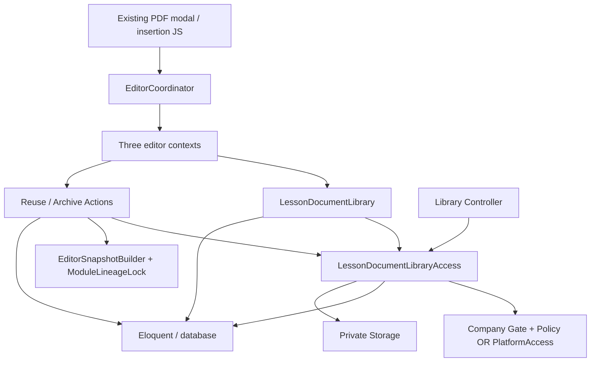

# Architecture: PDF library in the lesson editor

Run: `pdf-library-20260916` · scope: `pdf-library-v1` · assurance: critical · authoring round: 1 · 2026-09-16.

## 1. Context, references and decision scope

This contract implements [spec.md](spec.md) FR-001–009, SC-001–004 and the execution contract's AC-01–06 / INV-01–04. [scenarios.md](scenarios.md) owns B-01–16 and QA-01–08; this document defines implementation boundaries rather than another scenario matrix. Inputs also include [plan.md](plan.md), [research.md](research.md), [data-model.md](data-model.md), [contracts/library.md](contracts/library.md), [quickstart.md](quickstart.md), [design.md](design.md), `AGENTS.md`, and `docs/control-center-design-system.md`.

One repository is affected: `oceanix-api`. Add Open, Reuse and Archive inside the existing PDF modal in company-course, shared-course and shared-module editors. Company and platform ownership are separate, as explicitly confirmed in spec clarification D-03. The legacy `is_shared` column means platform ownership here; it does not authorize cross-owner library sharing. Authorized training access to existing links remains independent of catalog ownership.

No general document manager, physical deletion, restore UI, ownership transfer, new platform access-profile subsystem, external integration, editor rewrite, deployment or unrelated training/media behavior is included. Do not change `.env` or operate on development data for verification.

| Convention / decision | Repository evidence | Classification | Why needed |
| --- | --- | --- | --- |
| Thin coordinator and context adapters calling Actions with `handle` | `app/Livewire/CourseEditor/EditorCoordinator.php`, `Contexts/*EditorContext.php`, `app/Actions/Documents/UploadLessonDocument.php` | Existing | Preserve the three editor entry points and staged Save |
| Immutable PDF metadata, retained pivot, canonical HTML references | `app/Models/LessonDocument.php`, `app/Services/Documents/LessonDocumentLinks.php`, `database/migrations/2026_09_14_120000_create_lesson_documents_tables.php` | Existing | INV-02 and saved/copy compatibility |
| Company Gates and Policies; platform Account authority | `app/Providers/AppServiceProvider.php`, `app/Enums/Permission.php`, `app/Services/Platform/PlatformAccess.php`, `app/Models/Account.php` | Existing | INV-01; do not pass Account to User-only Gate callbacks |
| Separate append-only archival record and owner-scoped catalog/read service | New Documents classes in §3 | New feature-local | Archive without changing delivery or immutable metadata |
| Target locks followed by document lock | Existing upload lock order; new document serialization in reuse/archive | Existing target convention, new feature-local final lock | FR-007 / B-12 |
| Additive permission projection, retained rollback | `database/migrations/2026_09_06_011954_project_course_preview_permission_catalog.php` | Existing | No surprise grants or destructive rollback |
| Existing insertion token, stable record key, overlay/caret restoration | `resources/js/content-editor.js`, `resources/js/course-editor.js`, `resources/views/components/course-editor/root.blade.php` | Existing | INV-04 |

### Framework suitability and reference assessment

| Repository / installed version | Guidance actually consulted | References assessed | Native option and tradeoffs | Alignment |
| --- | --- | --- | --- | --- |
| `oceanix-api`: Laravel **13.26.1**, Livewire **4.4.1**, from `vendor/composer/installed.json`; PHP runtime 8.4.14 reported by readiness | Project instructions/design system; installed Toscanini `templates/adapters/laravel.json` and `docs/adapters.md` under `/Users/andrepiresdemello/.nvm/versions/node/v20.20.2/lib/node_modules/toscanini`; official versioned sources below | No external reference project supplied. Existing upload is integration/locking evidence; existing delivery and JS insertion are compatibility contracts. Existing image/video libraries are not authority for ownership or result limits. The design-system document's YesWeEat attribution supplies UI semantics only; no external architecture is copied. | Eloquent, Gates/Policy, small read/access services and two write Actions fit the actual target. Repository wrappers and event-driven archival add indirection without a requirement. Keeping platform Account authorization avoids an unrelated identity redesign. | **Aligned**. No framework deviation or material conflict requiring an extra owner decision. These are application choices, not framework mandates. |

Official sources consulted on 2026-09-16:

- [Laravel 13 authorization](https://laravel.com/docs/13.x/authorization): model Policies and global Gates; the application's pre-Gate ownership check is essential because its existing `Gate::before` may short-circuit a Policy.
- [Laravel 13 query builder, pessimistic locking](https://laravel.com/docs/13.x/queries#pessimistic-locking): use `lockForUpdate` in a transaction.
- [Laravel 13 database transactions](https://laravel.com/docs/13.x/database#database-transactions): automatic rollback and bounded deadlock retries.
- [Livewire 4 security](https://livewire.laravel.com/docs/4.x/security): public state/action parameters require fresh validation and authorization.

Boost assessment: `laravel/boost` is absent from installed package metadata and `composer.lock`; no Boost documentation tool is exposed in the available tool inventory. Project policy is optional in `.toscanini/manifest.json`. Installed vendor guidance paths were inspected; Nightwatch's unrelated Boost resources are not Laravel Boost guidance. The versioned official sources above were used as fallback. No Boost call is claimed and installation is not required by this architecture.

The orchestrator copies this assessment into `architecture.frameworkAlignment` in the execution contract; the Architect does not edit that artifact. Testing strategy is separate: follow project policy to demonstrate failing new checks before implementation when feasible, or record other defect sensitivity. No mandatory new TDD ceremony or extra architecture reviewer.

## 2. Architectural style

Use the established Laravel application design: Livewire presentation → editor context adapter → focused read/access Services or write Actions → Eloquent and private Storage. Two write use cases justify two Actions. One access boundary centralizes owner checks and identity differences; one projection service owns pagination and public row mapping. No repository, command bus, domain-entity duplicate or general file-management framework is needed.

Keep contextual learner/preview delivery in `LessonDocumentAccess`. A separate library read operation is necessary because an editor can open an own-scope PDF not yet attached to the current lesson, while existing delivery must continue to require both saved HTML membership and an attachment (INV-03).

## 3. Directory and module structure

```text
app/
  Actions/Documents/
    ReuseLessonDocument.php                 new
    ArchiveLessonDocument.php               new
    UploadLessonDocument.php                retained contract
  Services/Documents/
    LessonDocumentLibrary.php               new projection
    LessonDocumentLibraryAccess.php         new authorization/owner/private-read boundary
    LessonDocumentAccess.php                preserved contextual delivery
    LessonDocumentLinks.php                 preserved validation/mapping/copy
  Models/
    LessonDocument.php                      add archive relationship only
    LessonDocumentArchive.php               new retained record
  Policies/LessonDocumentPolicy.php         new company record Policy
  Http/Controllers/LessonDocumentLibraryController.php  new
  Enums/{Permission,PlatformPermission}.php  extend named abilities
  Providers/AppServiceProvider.php          register company document Policy
  Livewire/CourseEditor/
    EditorCoordinator.php                   modal state/action delegation
    Contexts/{CompanyCourse,SharedCourse,SharedModule}EditorContext.php
database/migrations/
  *_create_lesson_document_archives_table.php
  *_project_lesson_document_permission_catalog.php
resources/views/components/course-editor/root.blade.php
resources/js/{content-editor,course-editor}.js  only necessary PDF integration seams
routes/web.php
lang/pt_BR.json
tests/Feature/Documents/
  LessonDocumentLibraryTest.php
  LessonDocumentLibraryAccessTest.php
  LessonDocumentArchiveTest.php
tests/JavaScript/lesson-documents.browser.test.mjs
tests/Support/Documents/                    disposable fixtures + bounded PG probe
```

All new classes are feature-local. Enum/provider/routes are integrations into existing repository-wide facilities, not a new architectural standard. Extend existing access tests for prerequisites where appropriate; filenames above identify responsibility rather than requiring duplicate tests.

## 4. Class responsibilities and non-use

| Type | Responsibility / principal class | Deliberate non-use |
| --- | --- | --- |
| Livewire component | `EditorCoordinator`: modal/search/page/confirmation/busy/errors; validates UI input and delegates. Existing three single-file entry components continue to share `root.blade.php`. | No document query, file read, owner decision or transaction in component/Blade |
| Controller | `LessonDocumentLibraryController::company` and `::platform`: adapt respective actor/route context into `LessonDocumentLibraryAccess::open` | Two named methods, not invokable: distinct tenant and platform middleware/identity contracts; no CRUD controller |
| Form Request | N/A: GET has UUID path parameter, no form body; Livewire handles action validation | Do not introduce a Form Request for Livewire updates |
| API Resource | N/A: no new external JSON API | Projection arrays explicitly whitelist fields |
| Action | `ReuseLessonDocument::handle` retains draft pivot; `ArchiveLessonDocument::handle` creates one archival row | Neither saves editor HTML nor deletes storage; upload remains its existing Action |
| Service / external client | `LessonDocumentLibrary` projects pages; `LessonDocumentLibraryAccess` verifies fresh identities, scopes document queries and streams library bytes | No new external client or generically named Service |
| Repository | N/A | Eloquent already supplies persistence operations |
| Query Object | N/A | One focused projection plus the access service's owner query is sufficient |
| DTO / Value Object | Existing editor snapshot/revision protocol and explicit arrays suffice | No new mirror model/DTO for three primitive row fields |
| Model | `LessonDocument` original immutable record; `LessonDocumentArchive` append-only state; existing lesson pivot | No soft delete/global active scope that would hide retained links |
| Policy / authorization service | `LessonDocumentPolicy` for User record abilities; `LessonDocumentLibraryAccess` for owner checks and platform Account abilities | Do not adapt Account into a tenant User or call `Gate::forUser($account)` |
| Job / command | N/A for product operations; bounded test probe may use standalone test processes | Archive/reuse complete synchronously; no queue/eventual-consistency window |
| Event / listener | Existing browser `oceanix:insert-pdf` completion only | No new backend event/listener; archival table itself is the retained evidence |

## 5. Invocation, naming and query placement

Actions use `handle`, consistent with upload. Exact application signatures:

```php
LessonDocumentLibrary::page(User|Account $actor, string $search = '', int $page = 1): array;
LessonDocumentLibraryAccess::authorizeActor(User|Account $actor, string $ability): User|Account;
LessonDocumentLibraryAccess::ownedQuery(User|Account $freshActor): Builder;
LessonDocumentLibraryAccess::authorizeDocument(User|Account $actor, LessonDocument $document, string $ability): void;
LessonDocumentLibraryAccess::open(User|Account $actor, string $publicId): StreamedResponse;
ReuseLessonDocument::handle(string $publicId, string $context, int $rootId, int $recordId, User|Account $actor, string $revision): array;
ArchiveLessonDocument::handle(string $publicId, User|Account $actor): void;
```

`$ability` is an internal allowlist of `view`, `reuse`, `archive`, mapped to enums; it never comes directly from client payload. `ownedQuery` is internal application infrastructure: it performs no capability bypass and is called only after `authorizeActor`. User queries require a non-null positive current company ID, `company_id = actor.company_id`, `is_shared = false`. Account queries require `company_id IS NULL`, `is_shared = true`. Never use a missing company as the platform selector. Record checks repeat the same ownership predicate before any Gate. Freshly fetched actor must exist and be active; missing/revoked identity denies.

Eloquent queries are allowed in these Actions, the Documents read/access services, existing snapshot/lineage services, model relationships, catalog migrations and tests. Policy reads may inspect provided records and the existing permission resolver; they must not perform writes or stream files. No Eloquent/document Storage calls in controller, context adapter, coordinator, Blade or JavaScript. Actions may query and persist directly; do not introduce method-for-method Eloquent wrappers.

Company `LessonDocumentPolicy::{view,reuse,archive}(User $user, LessonDocument $document)` checks active identity, owner and corresponding atomic Gate. Register it explicitly. `LessonDocumentLibraryAccess::authorizeDocument` enforces owner first then calls the record Policy via Gate for Users. This preserves the existing centralized admin bypass without letting it cross owners. Reuse separately authorizes the destination through `EditorSnapshotBuilder` and its existing Course Policy; file permission cannot authorize a foreign/published target.

For Accounts, the access service uses `PlatformAccess::authorizePermission` and verifies that the resulting current Account matches the passed actor ID, then refreshes and checks active administrator status. It uses explicit platform abilities, never the tenant Policy/Gate path. Archive actor columns distinguish Account from User even when numeric IDs coincide.

## 6. Dependency direction



Models must not call presentation classes. Services/Actions must not depend on Livewire state, browser tokens or request-supplied actors. Context adapters resolve the trusted actor/root and translate operations; they do not duplicate catalog queries. New library code must not weaken or replace `LessonDocumentAccess`/`LessonDocumentLinks` authorization. Contextual delivery does not call active-library filtering. No new calls into WorkOS, Cloudflare or queues.

## 7. Cross-cutting ownership and system contracts

| Concern | Owner | Contract |
| --- | --- | --- |
| Validation | Coordinator plus service/Action boundary | UUID IDs; search string max 240; positive integer page; label retains existing max 100000. Search is literal case-insensitive filename substring with bound values/escaped LIKE metacharacters. Server-resolved context/root; allowlist three contexts; reject actor/context type mismatch. Repeat critical Action checks for direct calls. |
| Authorization | Access service, company Policy/Gates, platform access, existing target policies | Recheck every page/open/reuse/archive, including retries and after lock waits. UI booleans are informational only. Reuse/archive require view at runtime as well as catalog prerequisites. |
| Tenant isolation | Access service owner predicate | Filter before materialization, count, file streaming or admin bypass. Never derive owner from selected file, client company ID or attached lesson. INV-01. |
| Mapping | Library projection / existing links service / JS | Rows whitelist UUID, name, size, scoped open URL and allowed actions. Never serialize disk/path/actor data. Reuse returns `{id, name, reference}` with existing `/lesson-documents/{uuid}` reference. Route URLs are not stored in HTML. |
| Transactions / concurrency | Reuse and Archive Actions | Target locks then document lock for reuse; document lock alone for archive; details below. Only database writes inside retryable transaction, no streaming or JS dispatch. |
| Persistence | Document and archive models / pivot | Original document fields/timestamps unchanged; pivot retained with composite uniqueness. Add archive relationship without global scope. Archive model forbids update/delete. |
| External calls / timeouts | Private Storage inside library access | No external API. Read stream only after authorization; close in finally. Do not hold a database transaction for streaming. Missing/unreadable bytes produce controlled 404. Storage uses existing private disk configuration; no public URL. |
| Errors / outcomes | Access/Actions → coordinator or HTTP adapter | Missing/foreign document 404; missing capability/inactive identity 403; archived Open 404; unavailable archived Reuse 422 with localized error; target stale revision 422; no-longer-draft 409 or existing resolver 404. No filename/path on denied errors. Coordinator preserves text and exposes retry for operational failures, never inserts on failure. |
| Serialization | Library / controller | Page `{items, current_page, last_page, total, per_page:20}`; row `{id,name,size_bytes,open_url,can_reuse,can_archive}`. Stable `created_at DESC,id DESC`. Only owner-scoped totals. Open headers retain inline PDF, `private, no-store`, `nosniff`, `no-referrer`; safe disposition filename fallback. |
| Configuration | Existing filesystems/auth/tenant facilities | No new secret/package or `.env` variable. Use existing locale and private `lesson_documents` disk. |
| Telemetry | Retained archive row; existing exception reporting | Server actor/time are audit evidence; no compliance event type added. Report unexpected faults using existing reporting without filenames, paths, PDF contents or identity payloads in user messages. |
| Retries | Actions / coordinator | Database deadlock retries bounded to 3, re-run authority/target/archive checks; repeated archive returns success without changing original actor/time. Active duplicate reuse uses `syncWithoutDetaching`; no automatic network retry that could insert twice. In-flight controls disabled and completion tokens consumed once. |
| Migration / rollback | Two additive migrations | Create archival table and insert missing catalog rows, no grant backfill. Down refuses to drop archival table when it contains evidence; catalog down preserves rows/grants. Keep original document/pivot migrations unchanged. App downgrade retains schema/data and is not represented as undoing archive. |

### 7.1 Capabilities and private routes

Add `Permission::LessonDocumentsView = lesson-documents.view`, `LessonDocumentsReuse = lesson-documents.reuse`, `LessonDocumentsArchive = lesson-documents.archive`, including labels/group/prerequisites. View has no prerequisite; Reuse requires View plus `CoursesUpdate` (and transitively CoursesView); Archive requires View. Runtime Reuse checks View and Reuse and existing destination update authority. Active tenant admins retain the existing bypass only within explicit owner scope. Other profiles gain nothing automatically. Permission migration follows `insertOrIgnore`; do not run RoleSeeder.

Add identically valued named cases to `PlatformPermission`. Reuse/Archive declare View prerequisite; context-specific shared-course/shared-module update permission remains a separate target check. Platform admins already receive all platform abilities; this change does not create platform grantable profiles. This concrete rollout is part of the forthcoming consolidated owner approval of FR-003/D-04.

Routes:

| Method / path | Name / method | Middleware and actor |
| --- | --- | --- |
| GET `/c/{company:slug}/lesson-document-library/{document}` | `lesson-documents.library.open` → controller `company` | Existing `IdentifyCompany`, `auth`; `EnsureUserHasPermission:lesson-documents.view`; UUID constraint; current User must match route company |
| GET `/platform/lesson-document-library/{document}` | `platform.lesson-documents.library.open` → controller `platform` | Existing `EnsureUserIsPlatformAdmin`; `EnsurePlatformHasPermission:lesson-documents.view`; UUID constraint; current PlatformAccess Account |

Both delegate to `open`; do not use unscoped implicit document model binding. There is no bare `/lesson-documents/{uuid}` byte route and no separate REST write API. List/reuse/archive are existing authenticated Livewire operations, reauthorized inside the called Services/Actions even if middleware was previously satisfied.

### 7.2 Retained archival state

`lesson_document_archives`: `id`; unique non-null `lesson_document_id` FK with restrictive deletion; nullable `archived_by_user_id` and `archived_by_account_id`, each restrictive FK; non-null server `archived_at`. Exactly one actor column is populated, enforced in model creation and a database check supported by both PostgreSQL and the SQLite test schema. No generic `deleted_at`, mutable archive timestamp, client actor/time, archive reason workflow or original-metadata update. A unique document FK is the final duplicate safeguard. Add only focused owner/order indexes if required by the implemented projection, not a search subsystem.

Active listing uses absence of the archive relationship (`whereDoesntHave`). Do not place this condition on `LessonDocument` as a global scope, on the lesson's `documents()` relation, or in `LessonDocumentLinks::{validate,copy}` / contextual delivery. Thus existing attachments and copied/saved uses survive archival. No restore/delete operation exists.

### 7.3 Reuse/archive serialization and target safety

Reuse validates identity/context and resolves the authorized target once before entering its transaction. Inside the transaction retain `UploadLessonDocument`'s target order: for course contexts lock Course, CourseVersions in ID order, then shared-course compositions in ID order; company-course then locks the target Lesson, while platform contexts use `ModuleLineageLock::versions([$recordId])` (including its sorted advisory/lineage locking). Re-resolve fresh target and actor through the existing snapshot builder, require the requested record ID and draft state, and compare the supplied revision against `record:{id}` for shared-course or root revision for other contexts. Do not introduce a document-first target lock path.

Then select the owner-scoped document **without an archive join/filter** by UUID and `lockForUpdate`, and query archive existence in a separate subsequent statement. This avoids evaluating a stale absence predicate before a lock wait. Refresh authority after the lock wait, recheck owner and target state under retained target locks, reject any archival row, then `syncWithoutDetaching` the document ID. Commit before returning the canonical insertion result. No document timestamps, bytes, lesson HTML or published record are changed.

Archive freshly authorizes, selects its owner-scoped document by UUID with `lockForUpdate` inside a transaction, refreshes authority after any wait and rechecks record owner/ability, then creates its archival row only if absent. It never locks a target lesson/course or touches attachments. A repeated archive can address an already archived own-scope record and return success, but still must pass current authority.

The document-row acquisition/commit order decides B-12: archive committed first prevents attachment; reuse committed first retains attachment and a later explicit Save succeeds. An already attached archived item is not a new selection opportunity: a new Reuse call is refused, but existing HTML editing/Save/copy remains valid. Cancellation before server dispatch performs no mutation; a cancellation after an authorized request was already sent cannot undo a committed retained pivot, but its invalidated browser token prevents insertion. This matches staged upload semantics and does not grant byte access through an unsaved link.

## 8. Concrete execution flows

**Browse (AC-01/05):** existing `openPdfModal` captures selection/token/key → coordinator requests `list-pdfs` via the selected context → context obtains trusted actor and verifies current editor access → `LessonDocumentLibrary::page` authorizes View and scopes active query → paginator returns whitelisted rows. Search resets page 1; archive of final row clamps to last available page. Keep upload available when new library permission is absent; show unavailable library state without fetching records. Never apply a new editor snapshot as a side effect of browsing.

**Open (AC-02):** native `target=_blank rel="noopener noreferrer"` row anchor → named owner route/middleware → controller → access `open` → fresh capability/owner lookup → company record Policy or platform authority → active check → private stream. Opening has no attachment, dirty-state or Save effect. An archive occurring after the authorized read has begun need not cancel its in-flight stream; subsequent Open requests fail.

**Reuse (AC-03/04):** `reusePdf($uuid)` verifies current modal token/key, pending operation guard, label and target → `performMedia(..., 'reuse-pdf', ...)` → `ReuseLessonDocument::handle` executes §7.3 → existing `oceanix:insert-pdf` event carries model/key/token/reference/label → existing JS accepts matching editor/key/token once → closes modal and restores caret after overlay/focus settling. Empty label uses document filename; selected text remains formatted when label is unchanged. Explicit Save later uses existing `LessonDocumentLinks::validate` and saved canonical references. Browser token is a UI stale-completion guard, never an authorization credential.

**Archive (AC-04/06):** `requestArchivePdf($uuid)` selects a visible row for named confirmation → explicit confirm invokes `archivePdf` → context `archive-pdf` → Archive Action → refresh only library projection/confirmation state. Cancel restores focus to the row without calling Action. The server trusts UUID only after authorization, not confirmation text or client `can_archive`. Duplicate/retry operations retain the first actor/time. Errors keep editor HTML/custom label/selection and allow retry.

Context adapters support `list-pdfs`, `reuse-pdf`, `archive-pdf` alongside unchanged `upload-pdf` in `performMedia`; list returns the page shape, archive returns `[]`. Coordinator adds dedicated library search/page/items/error and pending-archive identity state. Stable root/context/key must remain locked/derived server-side; public search/selected UUID remain untrusted. Client selection state is not reset by list, search, Open, archive or confirmation cancel. Reuse integrates with the existing PDF operation guard; no image/video action changes.

The modal follows design-system Flux controls, native links/buttons, labelled search, status/error announcements, visible keyboard focus and narrow stacked rows at 390px. Long names wrap; row identity uses UUID, never filename; upload and library remain in this modal. English source strings map through `lang/pt_BR.json` without a label-colliding translation group. Detailed visual composition follows [design.md](design.md). In particular, child archive confirmation Cancel/Escape must not bubble into parent PDF cancellation or invalidate the pending insertion token. Permission denial clears unauthorized catalog data while retaining authored text. These details preserve the existing B-05/10/14/15 boundary and do not add a scenario.

## 9. Test seams

Use [scenarios.md](scenarios.md)'s boundaries and frozen QA-01–08; do not create a second matrix or broaden to unrelated flows. Pest checks use real Eloquent relationships, permission resolution, Actions, routes and fixture PDFs; `Storage::fake('lesson_documents')` can isolate deterministic private file tests. Fake WorkOS/Cloudflare with `Http::fake`, never authorization/owner checks, Policy outcomes or the database operation being proved. Assert positive controls before denials and unchanged bytes/metadata/HTML/pivots for INV-01–03.

Real browser tests and independent QA use the existing disposable `tests/Support/Documents` harness, extended with separate A/B/platform fixtures, grants/revocation, >60 files and retained published/copied uses. Selection, formatting, exact settled caret outside anchors, popup behavior, dismissal and modal failure preservation require the real editor/Flux lifecycle (INV-04). Baseline passes reported by readiness are not evidence of new functionality.

**Bounded PostgreSQL concurrency evidence is required for B-12 / QA-06.** SQLite verifies business outcomes and constraint behavior but cannot prove `lockForUpdate` or PostgreSQL lineage locks. Before Worker dispatch, establish `pdo_pgsql`, a safe disposable database/cluster and a tested connection-selection method with no `.env` changes. Never point a schema reset at a default/shared database. The test fixture owns a uniquely named database or isolated cluster, its private files and two independent processes/connections; use bounded lock/statement timeouts and explicit synchronization barriers, not timing-only sleeps.

Exercise each ordering with representative authorized draft state: one process acquires/holds the document row as the first real operation reaches its critical section, the second attempts the opposing real Action and demonstrably waits, then release/commit. Archive-first must produce no new pivot; reuse-first must retain pivot and allow subsequent actual draft Save after archive. Include repeated archival evidence and immutable metadata/byte assertions already required by B-11/12/13. No fake repository or SQLite substitute is acceptable for this lock claim. A test-only coordination seam or connection wrapper may signal lock acquisition; it must not register production routes or add production behavior. Independent QA executes the corresponding two-session behavior and references the bounded database probe for physical serialization. Failure is implementation evidence, not a reason to silently weaken FR-007.

## 10. Author verdict and classified conditions

Author readiness: **APPROVED_WITH_CONDITIONS**. There are no unresolved material architecture decisions or framework conflicts. This verdict means the design is implementation-ready for owner consideration, not owner-approved and not implemented.

| Condition / open decision | Category | Reference | Owner / next action | Could change architecture? |
| --- | --- | --- | --- | --- |
| Consolidated explicit approval of artifacts, D-04 rollout and frozen scope/hash | product-decision | §11; FR-003 | Product owner reviews concrete proposal; orchestrator records approval | Only if owner requests a different requirement; none currently unresolved within this proposal |
| Disposable PostgreSQL readiness and safe two-process setup | operational-dependency | §9, B-12 / QA-06 | Orchestrator verifies availability before Worker dispatch; no credential values in artifacts | No; blocks execution readiness if unavailable, not architecture approval |
| Add models/migrations/permissions/routes/Actions/projection/modal wiring and scoped tests | implementation-task | §§3–9; AC-01–06 | Worker after approval and task generation | No |
| Prove both lock orders and final real modal behavior | implementation-task | §9; INV-01–04 | Worker deterministic evidence; independent QA executes frozen matrix | No; discovered implementation failure routes to Worker |

Risks are confined to fresh authority across two identity types, archive/reuse ordering, retained delivery compatibility and editor state/caret synchronization. The prescribed boundaries and existing B/QA checks address them. Search indexing beyond a focused owner/order index, general file auditing, restore, cross-owner discovery and authorization redesign remain non-goals.

## 11. Product-owner approval

Approval is **pending**. The orchestrator records the explicit product-owner decision in `.toscanini/runtime/runs/pdf-library-20260916/execution-contract.json`, bound to this file's exact SHA-256 and `pdf-library-v1`, alongside specification/plan approval. The author verdict is not that decision. After approval and resolved execution readiness, proceed directly to task generation and the Worker, with no independent architecture-document reviewer.

After implementation, deterministic gates, the Code Review/Test Analyst checkpoint and executable QA, perform one full architecture-conformance check at the stable final checkpoint. Its separate evidence maps this document's sections and AC/INV IDs to raw implementation/tests. Architecture-affecting corrections receive only directed revalidation of assigned finding IDs and their causal delta, preserving the full-check evidence; do not redesign or amend this approved artifact silently.
