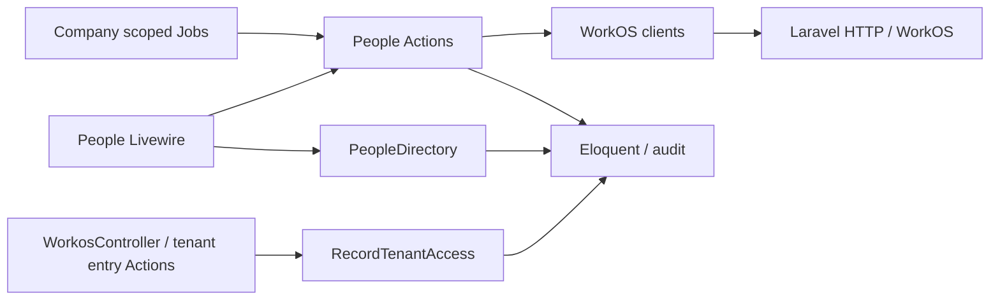

# Architecture: WorkOS invitation reconciliation

## 1. Context, references and decision scope

Target: Oceanix API managed worktree `workos-invite-sync/oceanix-api`, based on main 2370b33. Inputs: this directory's `spec.md`, `scenarios.md`, `plan.md`, `research.md`, `data-model.md`, `contracts/operations.md`, and draft execution contract `20261001-workos-invitation-sync`, scope `workos-invitation-sync-v1`. Decisions implement FR-001–012 / AC-01–08 / INV-01–06; scenarios remain authoritative for examples. No production calls, automatic scheduler/webhook, platform invitation redesign, identity migration or general authentication refactor.

| Convention / decision | Evidence | Classification | Purpose |
| --- | --- | --- | --- |
| Focused Actions with `handle`, read Services, direct Eloquent | `app/Actions/People/ImportPeople.php`, `app/Actions/Assignments/CreateManualAssignment.php`, `app/Services/Requirements/RequirementEligibilityService.php`, AGENTS.md | Existing | Preserve native application structure |
| Tenant scopes fail closed; explicit cross-company entry | `app/Models/Concerns/BelongsToCompany.php`, `app/Tenancy/TenantContext.php`, `app/Actions/Platform/EnterCompany.php` | Existing | Preserve ownership |
| WorkOS Laravel HTTP client, unique queued invitation jobs | `app/Services/Workos/WorkosInvitationService.php`, `app/Jobs/SendWorkosInvitation.php` | Existing, corrected locally | Extend existing integration |
| Separate assignment eligibility and tenant-access eligibility | `app/Enums/UserStatus.php`, `app/Models/User.php`, `app/Actions/Auth/AuthenticateSocialLogin.php`, `app/Actions/Tenancy/SwitchCompany.php` | New feature-local decision | FR-005/012 require different predicates |
| Persistent operation/attempt state and generation checks | Existing job uniqueness is insufficient for response-loss/retry and stale snapshots | New feature-local | AC-08 |
| Thin directory projection and distinct access/invitation labels | `resources/views/components/organization/⚡people.blade.php`, `⚡person.blade.php`, `docs/control-center-design-system.md` | Existing presentation contract; new feature-local projection | AC-01/02 |

### Framework suitability and reference assessment

One affected repository. `composer.lock` installed Laravel **13.26.1**, Livewire **4.4.1**, Flux/Flux Pro **2.17.0**. PHP 8.4 runtime, PostgreSQL production / SQLite tests. Consulted target AGENTS.md/design system, `.agents/skills/toscanini-architecture/SKILL.md`, installed Toscanini `/Users/andrepiresdemello/Code/toscanini/templates/adapters/laravel.json` and `docs/adapters.md` (also resolved via installed npm package). Laravel adapter detects dependencies and enforces explicit Boost policy; it adds no layering mandate.

Official guidance actually consulted: [Laravel 13 queues](https://laravel.com/docs/13.x/queues), [transactions](https://laravel.com/docs/13.x/database), [authorization](https://laravel.com/docs/13.x/authorization), [HTTP client](https://laravel.com/docs/13.x/http-client), [Boost](https://laravel.com/docs/13.x/boost), [Livewire 4 security](https://livewire.laravel.com/docs/4.x/security). `laravel/boost` is absent from lockfile and vendor package inventory, optional in `.toscanini/manifest.json`; no Boost documentation tool was available or executed. Version-appropriate official documentation is the fallback. Nightwatch's bundled Boost skill is unrelated telemetry guidance, not installed Boost.

References: [WorkOS invitation API](https://workos.com/docs/reference/authkit/invitation) and [organization membership API](https://workos.com/docs/reference/authkit/organization-membership) define integration compatibility only: cursor lists, organization/email matching, pending-only resend and membership suppression. No external reference project was supplied. Design-system ancestry is presentation evidence, not authority for application layering. Accept protocol behavior; reject copying foreign service/repository architectures. Native Eloquent + Actions + Jobs + focused clients provide the simplest sufficient fit. Alternatives (repository wrappers, event-sourced invitations, generic sync engine) add abstraction without a requirement. Alignment: **aligned**, no material framework conflict or approved deviation.

Test-first is a test strategy, separate from architecture: follow AGENTS.md's feasible defect-sensitive Pest checks before fixes; deterministic interleaving plus database evidence where SQLite cannot prove PostgreSQL lock behavior. No new TDD product choice.

## 2. Architectural style

Framework-native Laravel application with thin Livewire presentation, focused write Actions, read projection Services, typed external mapping, Eloquent records and queued orchestration. No enterprise Domain/Application/Infrastructure directory split. A small operation ledger is justified by progress, overlap prevention and delivery uncertainty; it is not a generic workflow engine. Local access and invitation projection never drive compliance history mutation.

## 3. Directory and module structure

All additions are feature-local unless explicitly existing extensions below.

```text
app/
  Actions/People/{QueueWorkosSynchronization,ReconcileWorkosInvitations}.php [new]
  Actions/People/{QueueWorkosInvitations,SendWorkosInvitation,ImportPeople}.php [extend]
  Actions/Auth/{AuthenticateSocialLogin,RecordTenantAccess}.php [extend/new]
  Actions/Tenancy/SwitchCompany.php; Actions/Platform/{EnterCompany,GrantPlatformCompanyAccess,InviteCompanyAdministrator}.php [extend]
  Services/People/PeopleDirectory.php [new read projection]
  Services/Workos/WorkosInvitationService.php [extend explicit read/resend/create methods]
  Services/Workos/WorkosOrganizationMembershipService.php [extend read-only active lookup]
  Data/WorkosInvitationSnapshot.php [new immutable allowlisted DTO]
  Enums/{WorkosInvitationState,WorkosOperationStatus}.php [new]; {Permission,UserStatus}.php [extend]
  Models/{User,WorkosSyncRun,WorkosInvitationAttempt}.php [extend/new]
  Policies/{UserPolicy,WorkosSyncRunPolicy}.php [extend/new]
  Jobs/{ReconcileWorkosInvitations,SendWorkosInvitation}.php [new/extend]
  Http/Controllers/Auth/WorkosController.php [extend successful tenant boundary only]
resources/views/components/organization/{⚡people,⚡person}.blade.php [extend]
resources/views/components/compliance/⚡assignments.blade.php [recipient projection extend]
database/migrations/* [access/snapshot/generation/operation records and explicit legacy transition]
database/seeders/PermissionSeeder.php; lang/pt_BR/**; lang/pt_BR.json [extend existing mechanisms]
tests/Feature/{People,Auth,Access,Platform,Requirements,Assignments}/ [Pest feature-local coverage]
```

## 4. Class responsibilities and non-use

| Type | Responsibility / principal class | Deliberate non-use |
| --- | --- | --- |
| Livewire | People list/detail validate filters/selections, authorize hydration/actions, invoke Actions/PeopleDirectory, render operation state | No provider calls, business matching, recipient SQL or transaction logic in view class |
| Controller | Existing WorkosController validates OAuth/session boundary and records tenant entry | Keep existing multi-method controller; no new invokable sync controller because Livewire owns entry |
| Form Request | Existing HTTP auth request contract retained; Livewire validates enum/boolean/ID list | No artificial Form Request for Livewire methods |
| API Resource | N/A, no new public JSON API | DTO/allowlisted read projection sufficient |
| Actions | Queue creates authorized durable intent; Reconcile applies snapshots; Send performs one authorized explicit attempt; RecordTenantAccess records successful access | No Action per Eloquent call |
| Services / client | PeopleDirectory shared read query/counts; WorkosInvitationService protocol only; membership client read lookup | No vague new Manager/Helper/Service abstraction |
| Repository | N/A | Eloquent already owns persistence |
| Query Object | N/A | PeopleDirectory and existing eligibility Service own reusable reads |
| DTO/value | WorkosInvitationSnapshot contains validated identity/state/provider timestamps, never tokens | No DTO for every record |
| Models | User owns tenant person/access/current snapshot; WorkosSyncRun owns synchronization state; WorkosInvitationAttempt owns explicit recovery state | Not named UserEntity/PersonModel; no network/model observers |
| Policy/Gate | Permission::PeopleSyncWorkos (`people.sync-workos`) with PeopleView prerequisite; global Gate, UserPolicy scoped sync/invite, WorkosSyncRunPolicy view | Admin bypass remains Gate::before, never Action bypass |
| Job/command | Jobs carry scalar company/actor/run or attempt IDs; establish context, delegate Action, restore in finally | No new scheduled command |
| Events/listeners | N/A | Direct transactional writes/audit; no listener implicitly sends invitations |

## 5. Invocation, naming and query placement

Actions use `handle(...)`, matching existing convention. Jobs use Laravel `handle` injection; clients use precise `get`, `listPage`, `resend`, `create`, `activeMembership` methods. Enums provide English labels/pill modifiers. Avoid generic sync helpers.

Eloquent queries allowed in Actions owning writes/locks, read Services, Policies for ownership, Models' relations/scopes and existing framework adapters. Jobs may bootstrap Company/actor/run by explicit IDs; all business queries stay in Actions. New/changed directory queries move into PeopleDirectory, including departments/functions and assignment aggregates. Forbidden: SQL in Blade markup, duplicated filters across list/actions, network in Models/Policies, queries hidden in DTO constructors. Existing unrelated component queries are not refactored.

Assignment recipient scope explicitly accepts all four UserStatus cases; add `canAccessTenant()` accepting invited/active and replace the three access callers of `isEligibleForTraining`. Keep account active checks. Do not redefine a training predicate and leave login callers using it. Audit all existing `eligibleForTraining` consumers, including manual assignment picker, without widening playback/access paths.

## 6. Dependency direction



Presentation may call Policies, Actions and projections. Actions may call precise clients/persistence/audit. Clients map protocol and do not decide local access or authorization. No client→Livewire, Model→client, projection→write Action or sync→assignment materialization calls. Existing assignment Actions/events retain their contracts.

## 7. Cross-cutting ownership and system contracts

| Concern | Owner | Contract |
| --- | --- | --- |
| Validation | Livewire + Action entry | Enum filters, boolean no-access, integer unique selected IDs (existing 500 selected cap); derive company/actor server-side; never truncate silently |
| Authorization | Gate/Policies + queued Action | Requery actor within company, verify active account and tenant-access status, Gate::forUser; record Policy then side effect. Reauthorize on hydration, initiation, job start and each send; revoked/missing actor means terminal skip/denial |
| Tenant isolation | Job/Action bootstrap + TenantContext | Explicit company ID predicates even when removing global scope; save prior context and restore in finally including failed callbacks; no ambient authenticated actor in queues |
| Mapping | DTO + reconciliation Action | Validate IDs, supported state, normalized exact email (trim/lowercase), exact organization and timestamps; reject malformed/cross-organization matches |
| Transactions/concurrency | Actions | Short transactions lock person/operation, compare invitation generation and ID/email/org read tokens; no HTTP under DB row lock; monotonic local access never included in sync updates |
| Persistence | User + operation records | Nullable UTC local first/last access; separate workos_last_sign_in_at; invitation state/timestamps/verified_at and availability/error indicator; integer invitation generation; run/attempt company ownership |
| External calls | WorkOS clients | Existing 12s response timeout plus bounded connection timeout; GET list/get/user/membership only for sync; POST resend pending, POST create expired/not-invited or explicitly selected revoked; no blanket 404→create |
| Failure translation | Actions / operation records | Bounded enum reason codes and localized explanations; preserve prior verified snapshot/date on transport error, expose unavailable/stale; 404/mismatch yields unverified, not pending |
| Serialization | DTO/projection | Only allowlisted state, counts and sanitized reasons; never payload/token/accept URL or credentials |
| Configuration | services.php / queue.php | Existing WorkOS API key and queue configuration; new safe limits in config if needed; .env untouched |
| Logging/audit | Actions / AuditLog | Explicit queued actor_id/company_id; atomic local snapshot/attempt/run success plus audit in same DB transaction; administrative trail, never compliance_events for sync |
| Retries | Job/attempt lifecycle | Read-only calls up to 3 bounded attempts with delay/rate-limit handling; POST once per durable attempt, never blind automatic replay after uncertain delivery |
| Migration/rollback | Additive migrations + explicit data transition | See below; preserve all operational rows and roles; no identity/date fabrication |

### Provider matching, scalability and freshness (FR-001–004/008–011)

Use provider lists constrained by organization and exact normalized email for each local person. Process local IDs by `chunkById(100)`, exhausting each cursor list (limit 100, advancing `list_metadata.after`, repeated-cursor guard) and retaining only current candidate plus accepted-history summary. This uses bounded memory independent of company/provider inventory and isolates one person's failure; concurrency is serial/bounded, not one giant in-memory company collection. Stored ID receives direct GET and email/org validation. For a valid stored ID it remains current; where absent/404, choose newest matching invitation by `(created_at, id)` descending, not remote page order. A mismatched stored ID marks unverified and requires valid discovery before replacement. Persist accepted-history timestamp separately from current accepted_at; never erase historical acceptance when replacing current ID. Conflicting accepted identity is unavailable evidence, not a different-person reassignment.

Read current membership separately using known WorkOS user/account ID and exact company organization; active membership suppresses send even with old expired invitations. For acceptance belonging to another WorkOS user, validate identity email before relying on it; otherwise fail closed for sending. WorkOS last_sign_in_at is obtained only for a validated linked provider user and stored/displayed separately; it never activates User or populates local timestamps. Successfully empty discovery with no stored ID is not invited; deleted stored ID without replacement is unverified. Missing API organization/config fails run honestly.

Apply snapshots in a transaction only if company/email/current ID/generation still match captured values; increment generation on snapshot changes and new sends. Never write status/first_access_at/last_access_at during sync. Superseded results are skipped and eligible for a fresh read, not declared current. A run stores total/processed/succeeded/skipped/failed, started/finished and last successful full synchronization timestamp (derive latest completed run). Partial success does not advance full-success time; per-person verification timestamps may advance for successful reads. Failed pagination cannot prove absence/current discovery; retain prior evidence and error indicator.

### Durable intent and external uncertainty (AC-03/08)

Queue initiation locks the Company row, reuses an existing queued/running sync, creates run and dispatches after commit. Unique Job plus shared cache overlap lock supplements durable state. A run ID prevents replay after terminal completion. If dispatch fails, mark failure visibly; do not leave queued forever.

Recovery creates one WorkosInvitationAttempt per selected/default recipient, recording actor/company/person/mode, status, send_started_at, completion/reason and resulting ID. Enforce one open attempt per person with short person lock and durable check; job uniqueness and shared overlap lock protect execution. Default all action uses the shared eligible projection: not invited/pending/expired/unverified candidates, excludes accepted/revoked/blocked; execution still performs full fresh discovery/membership validation. Selected revoked is explicitly marked in attempt mode. Batches chunk local IDs and preserve visible skip reasons.

Before POST, transaction rechecks actor/recipient/current generation, reserves attempt as sending and commits. No DB lock is held during HTTP. A successful validated response commits current invitation ID/sent server time/snapshot/generation, succeeded attempt and audit atomically; stale-generation or persistence failure after POST becomes delivery-unconfirmed and cannot overwrite newer invitation state. On worker death/timeout/lost response, the durable sending marker prevents replay: retry reconciles read-only and surfaces delivery-unconfirmed; operator may make a new explicit recovery decision. Do not assert exactly-once delivery or reinterpret uncertainty as success. Definitively failed GET can retry; POST errors are recorded, and a new operator action starts a fresh intent. Synchronization itself never creates attempts or POSTs.

### Access boundary and legacy transition (AC-04/05, INV-04/05)

RecordTenantAccess locks the explicitly scoped person and linked account, rechecks active account + invited/active person, sets first_access_at only if null, updates last_access_at with server time and changes invited→active. It never unsuspends/unterminates. AuthenticateSocialLogin retains verified identity/local provisioning/account-link/bootstrap rules but permits invited. WorkosController calls the action only after tenant identity validation and successful Auth::login/session regeneration; failure clears the newly established auth session rather than leaving access without successful recording. Platform-only callback does not record tenant access. EnterCompany/SwitchCompany validate platform/account binding, target status/account, establish actual tenant session then call the same action, restoring/clearing session/context on failure. Provisioning/granting a role or membership alone is not entry; new users are invited, existing protected statuses are preserved. Impersonation is not person access evidence and is outside the changed entry flows.

Migration adds nullable timestamps and snapshot/generation fields with company/state and company/first_access indexes, run/attempt indexes and no destructive cascading user deletion. Explicit legacy transition reclassifies **active tenant Users with null first_access_at** to invited, including linked identities; suspended/terminated are untouched. Record bounded audit counts, not invented historical dates. Roles, profiles, organization links, assignments/certificates/events remain untouched. Separate schema migration from data transition; down must not bulk promote invited people or drop populated evidence tables. Operational rollback disables the feature/reverts application using retained additive schema; status rollback requires an explicit reviewed recovery using migration audit provenance and intervening state checks, not blind reversal. No deployment/migration execution is authorized here.

## 8. Concrete execution flows

1. People `synchronize` → global Gate + scoped Policy → QueueWorkosSynchronization(actor/company) → transactional run + afterCommit Job → context/bootstrap/reauthorize → ReconcileWorkosInvitations → paginated client reads/DTO → generation-checked snapshot + progress/audit → PeopleDirectory polling of scoped run.
2. People selected/default recovery → QueueWorkosInvitations → authorized durable attempts → SendWorkosInvitation Job → restored context/actor Policy → fresh invitation/membership reads → skip or reserve send → precise resend/create → atomic local result/audit → visible recipient outcome.
3. OAuth callback → existing state/provider verification → AuthenticateSocialLogin → tenant Auth::login/session → RecordTenantAccess → dashboard; rejected identity/account/status → existing error route without access evidence. Platform callback → platform account only; EnterCompany or SwitchCompany → authorized target tenant session → RecordTenantAccess.
4. Import/admin provisioning → existing transaction/roles → invited new person; manual assignment picker or RequirementEligibilityService → all statuses with existing target/effective date/course constraints → existing CreateManualAssignment/AssignmentMaterializationService → frozen version/event transaction; sync never touches these obligations.

UI remains in existing directory/detail composition. Separate person status, current invitation state, local first/last access and external authentication evidence. PeopleDirectory owns combined query and matching counts; pagination order `(name,id)`, 25 rows, filters reset page/selection. Labels become Open training/Overdue training. State pills use enum labels/tokens. Poll only while scoped run/attempt active; authorize each hydration/read, stop after terminal state, preserve rows during loading. Queued/running/completed/partial-failure/failed text plus counts and bounded outcome list support recovery. Disabled initiating controls complement server locks. Errors use visible text, accessible live status; narrow screens retain identity/status/action and scroll table; English keys/PT-BR translation follow design system. No internal run ID/raw provider data rendered.

## 9. Test seams

SC-001–018 and contract QA matrix define complete coverage, not this section. Pest Http::fake exercises actual clients, cursor pagination, malformed/contradictory/membership data and POST operation selection. Queue::fake checks dispatch/uniqueness intent only; execute real Job handlers against temporary database for authorization revocation/context restoration/failure persistence. Real Action/Livewire tests prove Gate/prerequisites/Policy/admin bypass, aggregate queries, combined filters and durable intent. Deterministic Http fake interleaving changes invitation generation or records login before snapshot commit to prove INV-05. PostgreSQL integration probe proves lock/open-attempt behavior; SQLite cannot establish row-lock semantics. Database rollback/error injection proves snapshot/run/attempt/audit atomicity; uncertain POST never blindly retries. Auth HTTP/session tests cover actual callback, switching/platform entry and failed access timestamps. Existing materialization/recurrence/event tests plus representative four-status fixtures prove INV-02/03 and AC-06. Executable browser QA supplies mobile/keyboard/loading evidence; provider QA uses stub WorkOS and isolated DB, never real email. No result is claimed executed by this architecture.

## 10. Author verdict and classified conditions

Author readiness: **APPROVED_WITH_CONDITIONS**. No unresolved architecture choice; owner acceptance of explicit product proposals is still required before implementation.

| Condition | Category | Reference | Owner / next action | Material architecture change? |
| --- | --- | --- | --- | --- |
| Approve legacy reclassification and explicit-only revoked recovery, company batch and separate evidence | product-decision | FR-006/009, §§7–8 | Product owner approves spec/contract/artifact hash or returns changed rule | Rejection may require amendment; proposed design is complete |
| Add migrations/classes/permission/queue/UI/tests | implementation-task | §§3–9, AC-01–08 | Worker after approval | No |
| Verify dependencies/licence, queue/cache, safe isolated QA DB/stub | operational-dependency | contract readiness | Orchestrator completes nonsecret readiness evidence before Worker | No |
| Exercise PostgreSQL concurrency seam and executable UI | spike | AC-08/SC-008/012/018 | Worker/QA within frozen scope | No unless verified infrastructure cannot support selected locks |

## 11. Product-owner approval

**Pending.** Author verdict is readiness, never owner approval. `execution-contract.json` must bind explicit product-owner decision to architecture SHA-256 and scope `workos-invitation-sync-v1`, approve specification/clarification/plan and freeze contract before Worker. No independent architecture-document reviewer is required. After final implementation, deterministic checks, review checkpoint and executable QA, Architect performs one separate conformance report against this approved artifact and raw code/tests, with directed revalidation only for architecture-affecting corrections.
